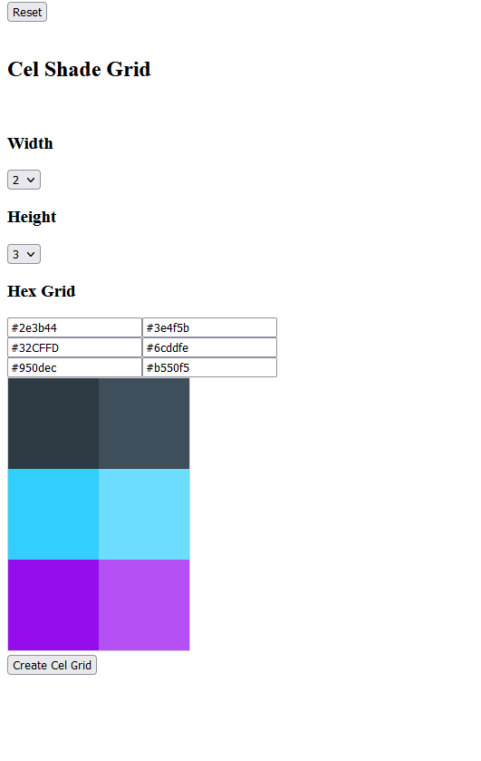
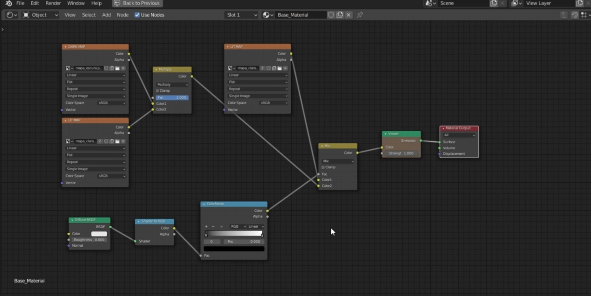

# Cel Shade color picker

cel-shade-color-picker.surge.sh

## What is this?

A small tool to help me create `dark maps` and `lit maps` for my cel shading workflow in blender.

Making these by hand is very annoying so I made this

## Example:
### DarkMap

### LitMap

### Using the Dark Map and Lit Map in Blender

